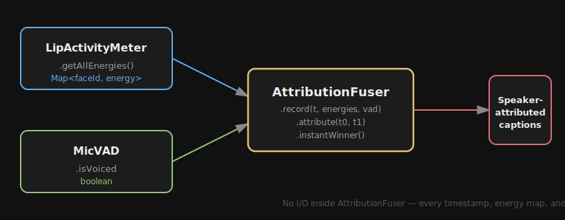
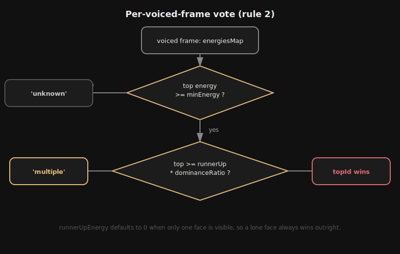
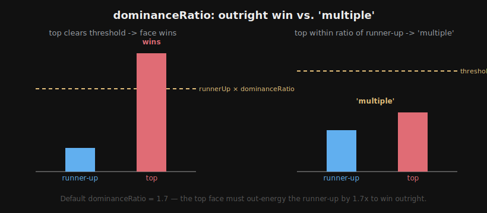
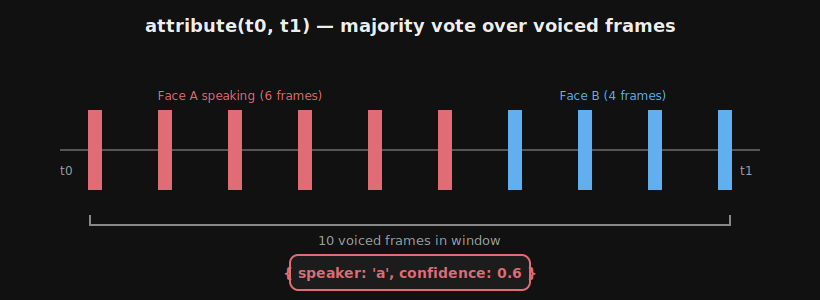
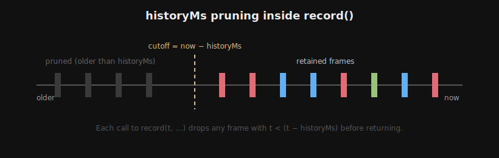
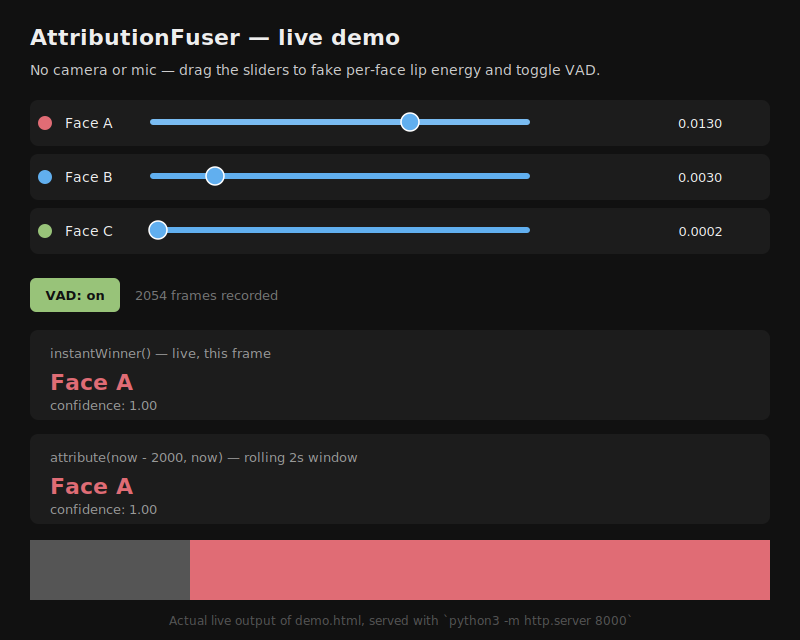

# toolkit-attribution-fuser

<p align="center">
  
  
  
</p>

`AttributionFuser` is a standalone logic module that fuses per-face lip-energy
history with voice activity (VAD) over time to answer: **who spoke during
time window `[t0, t1]`?**

It is the core attribution IP of a speaker-attributed captioning system. It
has no I/O of any kind — no camera, mic, DOM, or internal timers — every
timestamp is supplied by the caller, so it runs identically in the browser
and in Node.



## Install

No npm dependencies. Copy `attribution-fuser.js` into your project, or clone
this repo directly.

```js
import { AttributionFuser } from './attribution-fuser.js';
```

## API

```js
const fuser = new AttributionFuser({
  dominanceRatio: 1.7,   // top face must beat runner-up by this factor
  minEnergy: 0.00004,    // below this, nobody is visually speaking
  historyMs: 30000,      // how much attribution history to retain
});

// Call every frame (or every N ms):
fuser.record(timestampMs, energiesMap, vadActive);
// energiesMap: Map<faceId, number> — lip energy per visible face
// vadActive: boolean — is the mic hearing speech right now

// Ask who owned a time window (e.g. when an ASR chunk finishes):
fuser.attribute(t0, t1);
// → { speaker: faceId | 'multiple' | 'unknown', confidence: number 0-1 }
// confidence = fraction of voiced frames in the window won by returned speaker

fuser.instantWinner();  // → same shape, for the latest recorded frame (live UI)
```

### Constructor options

| Option           | Default   | Meaning                                                        |
|------------------|-----------|------------------------------------------------------------------|
| `dominanceRatio` | `1.7`     | Top face's energy must be at least this many times the runner-up's to win outright. |
| `minEnergy`      | `0.00004` | Energy floor below which a face is considered not speaking.     |
| `historyMs`      | `30000`   | How long recorded frames are retained before being pruned.      |

## Attribution rules

| # | Rule |
|---|------|
| 1 | Frames where `vadActive === false` contribute nothing to any window. |
| 2 | Per voiced frame, the frame vote is: the highest-energy `faceId` **if** its energy `>= minEnergy` **and** energy `>= runnerUpEnergy * dominanceRatio`; `'multiple'` if the top two faces are within the dominance ratio of each other (and top `>= minEnergy`); `'unknown'` if all faces are below `minEnergy` (someone off-screen spoke). |
| 3 | Window result = majority vote across voiced frames in `[t0, t1]`; ties → `'multiple'`. |
| 4 | Zero voiced frames in the window → `{ speaker: 'unknown', confidence: 0 }`. |
| 5 | Records older than `historyMs` are pruned automatically inside `record()`. |
| 6 | `instantWinner()` applies rule 2 to the most recent frame (voiced or not — if the latest frame wasn't voiced, returns `{ speaker: 'unknown', confidence: 0 }`). |

`confidence` is always the fraction of voiced frames in the window won by
the returned `speaker` (for `instantWinner()`, that's a single frame, so
confidence is `1` whenever a speaker is determined).

### How a single frame is voted (rule 2)



### How `dominanceRatio` decides outright win vs. `'multiple'`



### How a window result is computed (rule 3)



### How pruning keeps memory bounded (rule 5)



## Tests

Plain JS, no test framework required:

```sh
node attribution-fuser.test.js
```

Covers: a single clear speaker, close-energy faces resolving to `'multiple'`,
an entirely unvoiced window, a mid-window speaker switch (60/40 split),
all-energies-below-floor, history pruning, faces appearing/disappearing
between frames, an exact vote-count tie, a non-Map `energiesMap` input,
the exact `dominanceRatio`/`minEnergy` boundary values (both use `>=`, so
an exact match must resolve the same as clearing the threshold), and a
tie between a real speaker's vote and an `'unknown'`/`'multiple'` vote.

## Demo

An interactive playground with no camera/mic required — three sliders for
fake per-face energies, a VAD on/off toggle, a live `instantWinner()`
display, a rolling 2-second `attribute()` window, and a canvas timeline of
frame-by-frame votes.

```sh
python3 -m http.server 8000
```

Then open `http://localhost:8000/demo.html`.



## Composes with

`AttributionFuser` is designed to be fed by other tools in the toolkit, but
has zero dependency on them:

- `LipActivityMeter.getAllEnergies()` → feeds the `energiesMap` argument to `record()`.
- `MicVAD.isVoiced` → feeds the `vadActive` argument to `record()`.

## License

MIT
